# Projeto para venta de padaria online 
Django 4.2.7 e Python 3.12.0

### Para rodar o projeto

```
git clone git@github.com:soemesa/bakery_sales.git
```
* Criar banco de dado `padaria_db` em servidor mysql
* No arquivo loja/settings.py:91 mudar as configurações do banco como usuário e senha

- Para **Linux**:

```
cd bakery_sales
python -m venv venv
. venv/bin/activate
pip install install -r requirements.txt
python manage.py migrate
```

- Para **Windows** (Não testado por não ter Sitema Operacional):

```
cd bakery_sales
python -m venv venv
venv\Scripts\activate.bat
python -m pip install --upgrade pip setuptools wheel --user
python -m pip install -r requirements.txt
python manage.py migrate
```

### Criar super usuário (necessário para aumentar o estoque)
```
python manage.py createsuperuser
```

### Para acessar ao site 
```
http://localhost:8000
```

### Para aumentar o estoque dos produtos da padaria
```
http://localhost:8000/admin
```
* Utilizar o super user criado

## Pupular banco de dados para preencher registros para teste
```
python manage.py dbrestore
```
### No backup muda o super user
```
user: admin
password: wasaloko
```

# Prints do site
### Tela inicio
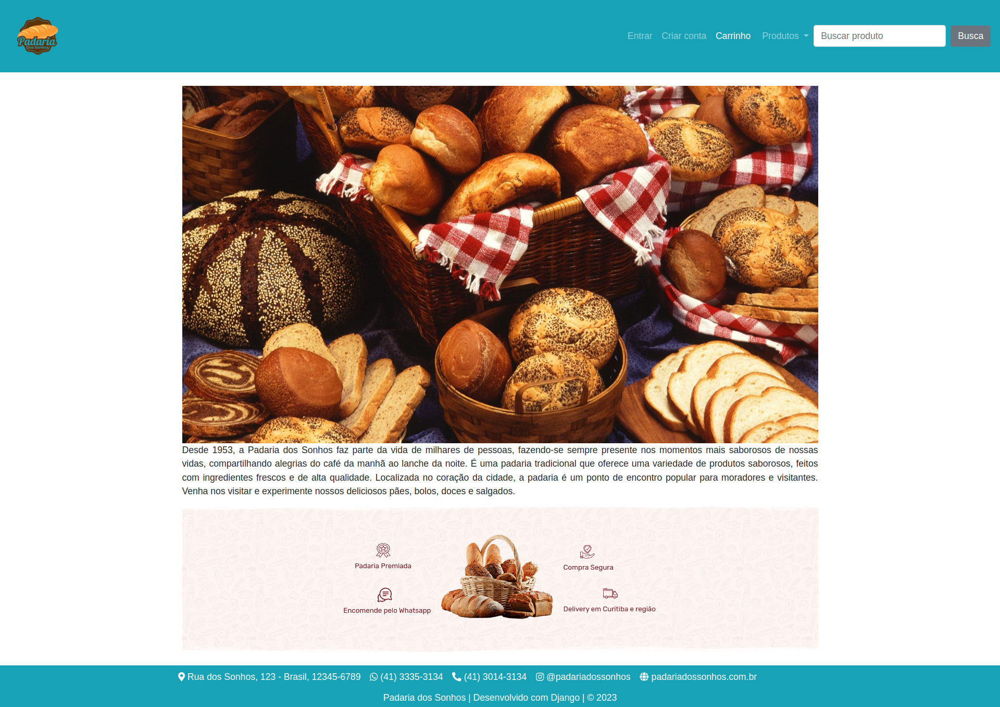

### Tela de login e cadastro
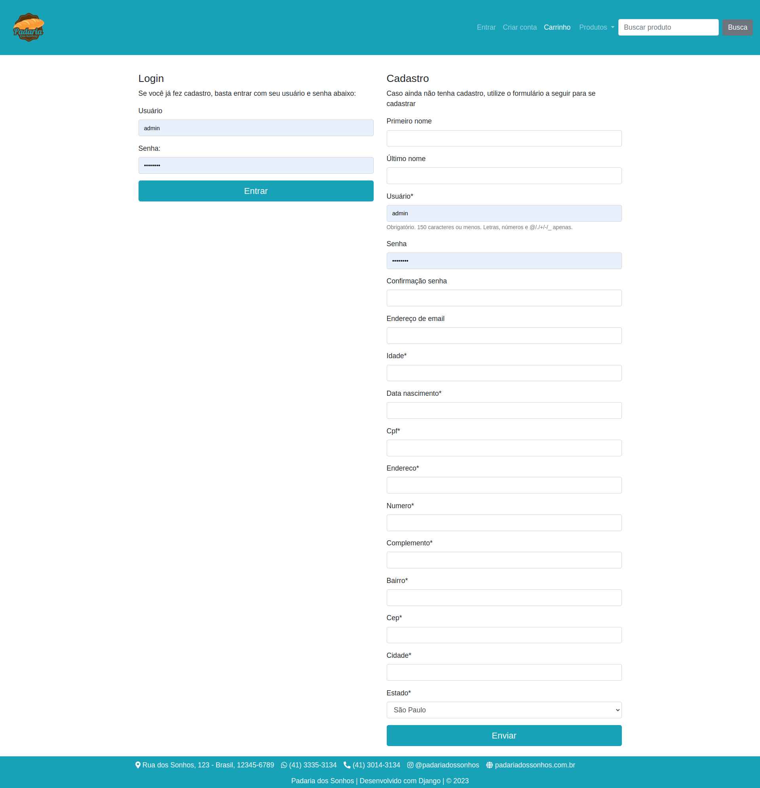

### Tela de lista de produtos
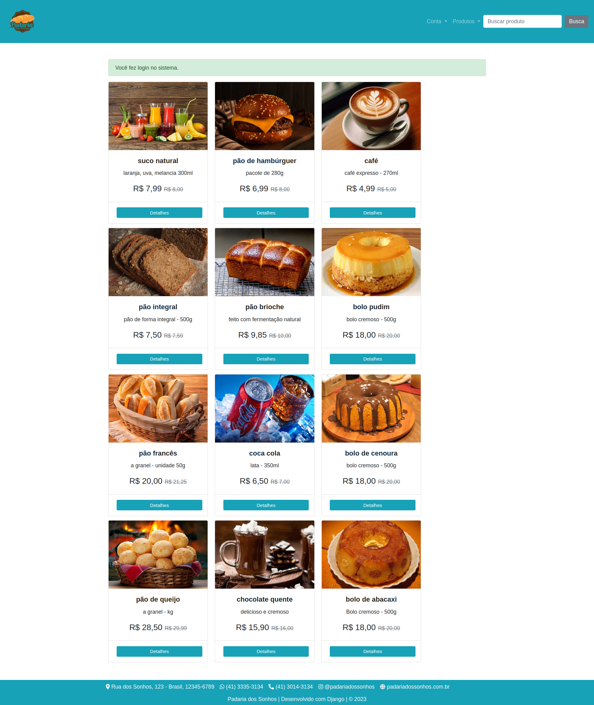

### Barra de navegação de tipos de proutos
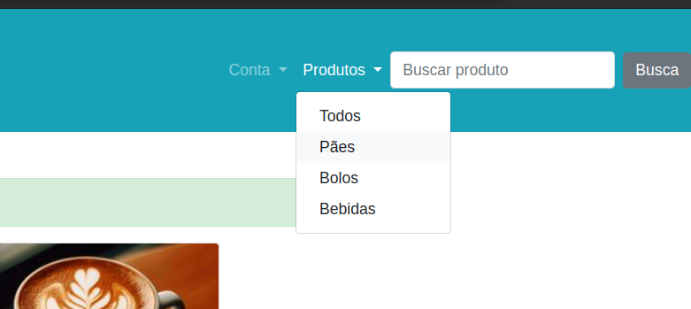

### Filtro de produtos
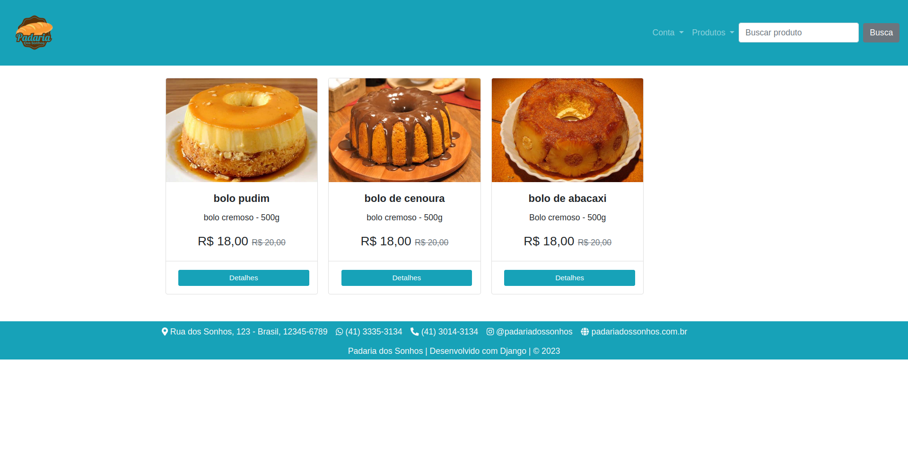

### Busca produtos
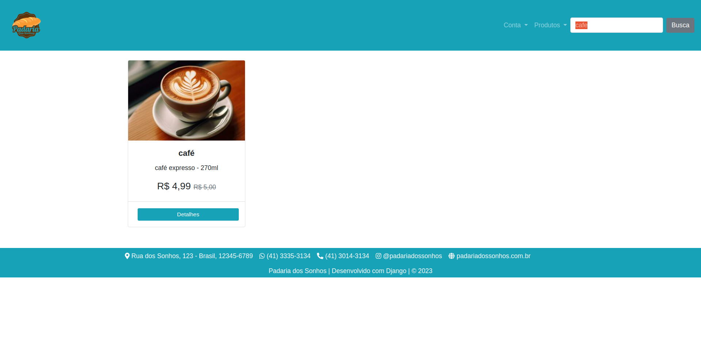

### Detalhe produto
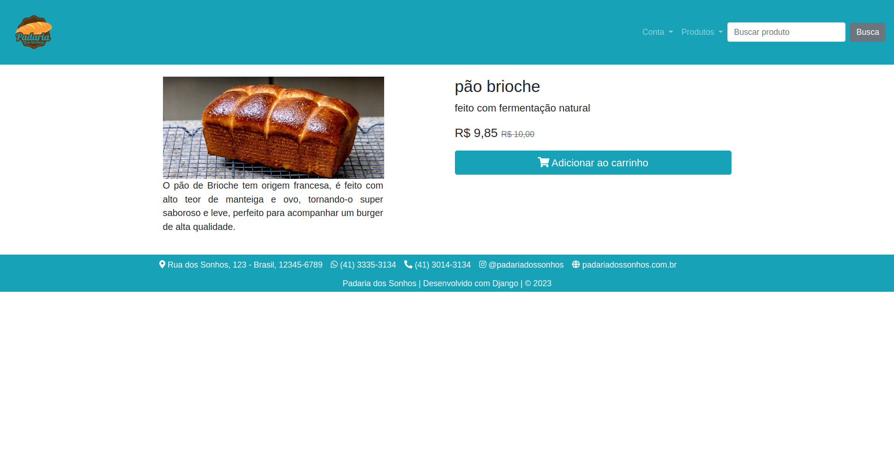

### Adicionado ao carrinho
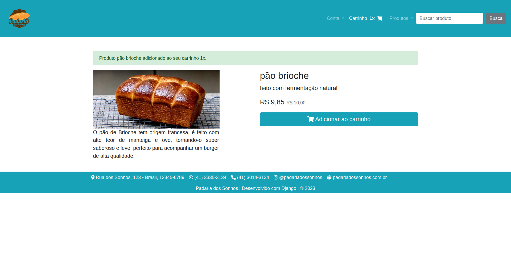

### Lista no carrinho
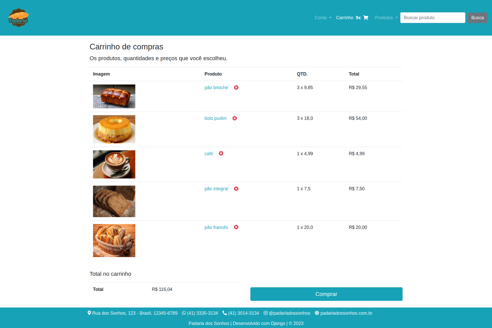

### Resumo da compra
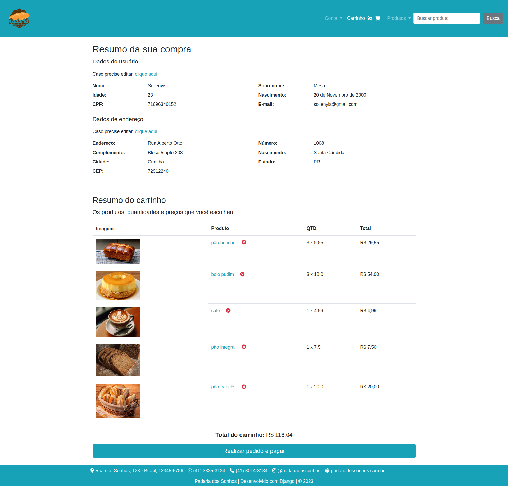

### Pedido Realizado
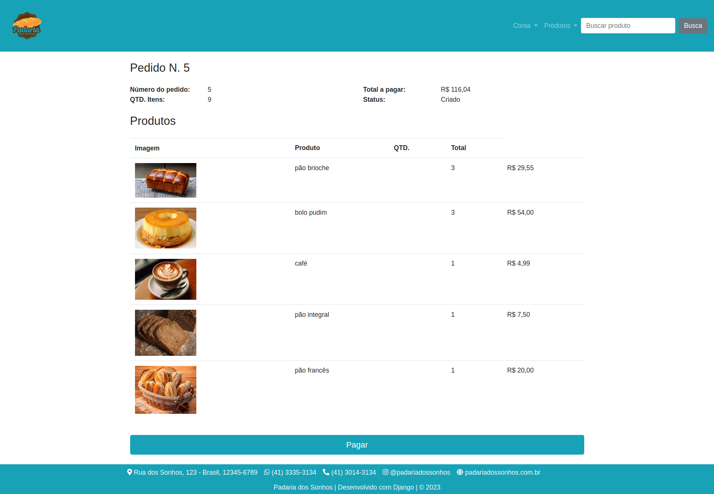

### Pagamento feito
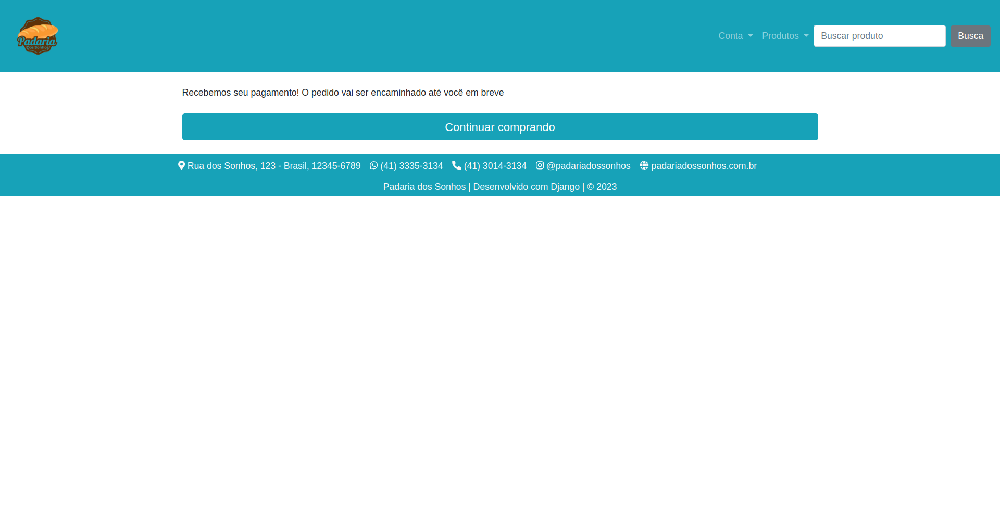


